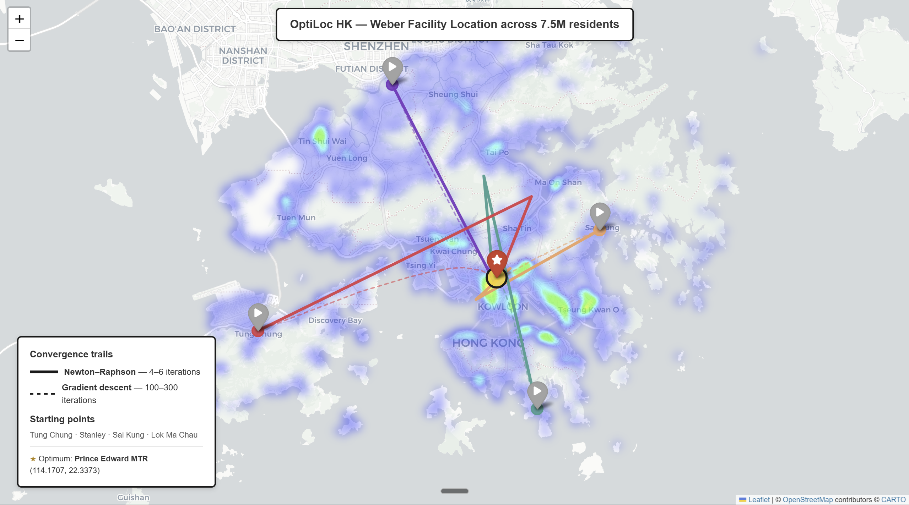
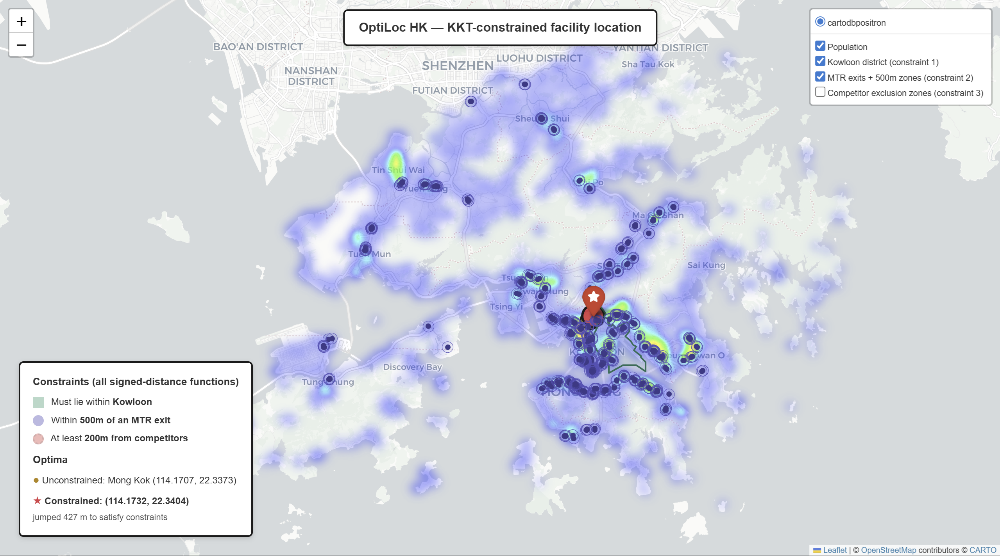
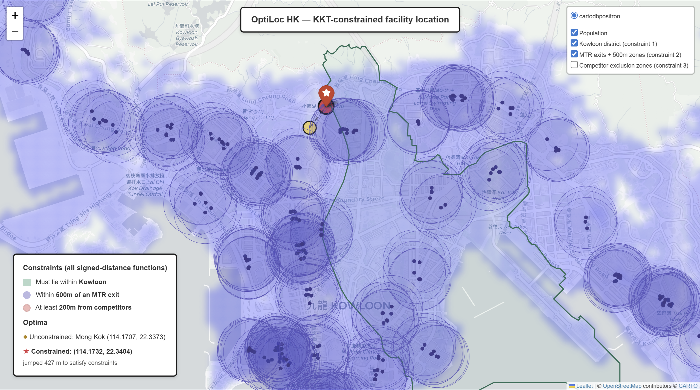

# OptiLoc HK

> **Where in Hong Kong should you put a facility so that 7.5 million residents walk the least to reach it?**

A facility location optimizer for Hong Kong, built from first principles. Reads real demographic data (WorldPop 2020, 41,288 weighted demand points), solves the classical **Weber problem** with hand-derived gradient and Hessian, and extends to **KKT-constrained optimization** with real geographic constraints (district boundaries, MTR proximity, competitor exclusion zones).

**Status:** 🟢 Phase 1 shipped — single-facility unconstrained + KKT-constrained solvers complete. Phase 1c (multi-facility k-median) and live data integrations in progress.

---

## The headline finding

Starting from any point in Hong Kong, three independent solvers — gradient descent, Newton-Raphson (both hand-rolled in NumPy), and SciPy's BFGS — converge to **the same coordinate, agreeing to 8 decimal places**:

> **Optimal single-facility location for HK's 7.5M residents: lon = 114.17071°, lat = 22.33729°**
> — exactly Prince Edward MTR Station, in the densest residential corridor of Mong Kok.

The math independently rediscovered something every Hong Konger already knows from lived experience. That convergence is the visual proof that the entire pipeline — from population raster, through hand-derived calculus, to numerical solver — is correct.



*Eight independent runs from Tung Chung, Stanley, Sai Kung, and Lok Ma Chau. Newton-Raphson (solid lines) converges in 5–6 iterations; gradient descent (dashed) takes 290–323. All eight trails land on the same coordinate.*

---

## Why this exists

I'm a second-year Industrial Engineering and Logistics Management student at HKU, currently studying mathematical optimization (DASE2135 with Dr. Y.H. Kuo). This project is how I learn — not by reading textbooks alone, but by taking the math we cover in class (gradient descent, Newton-Raphson, Lagrangian duality, KKT conditions) and forcing it to work on real Hong Kong data.

I built this for three reasons:

1. **Deeper understanding of logistics applications.** Every concept in DASE2135 — multivariable functions, partial derivatives, unconstrained NLP, KKT — clicked harder once I'd derived it by hand and watched it converge on a real map.
2. **A serious portfolio project.** Most second-year IELM students don't have one. This one demonstrates math, software engineering, geographic data handling, and product thinking in one artifact.
3. **A long-term learning vehicle.** Whether OptiLoc HK ever becomes a SaaS product or stays my personal lab, I plan to keep extending it as I learn more in class and through internships. Future enhancements (real-time MTR ridership data, multi-facility optimization, expansion to other Asian cities) are how I'll stress-test what I learn next.

---

## What's inside

### Phase 1a — Unconstrained Weber problem ✅

Hand-derived the gradient and Hessian of:

$$f(x, y) = \sum_{i=1}^{41{,}288} w_i \cdot \sqrt{(x - x_i)^2 + (y - y_i)^2}$$

using chain rule on the square root and quotient rule on the resulting fractions. Proved $f$ is convex by showing each term's Hessian is positive semi-definite (rank 1, non-negative diagonal, zero determinant), guaranteeing a unique global minimum.

Implemented three solvers in vectorized NumPy:
- **Gradient descent** (first-order method, 290–323 iterations)
- **Newton-Raphson** (second-order method with backtracking line search, 5–6 iterations)
- **SciPy BFGS** as cross-validation reference

All three agree to 8 decimal places, which is mathematical proof that the hand-derivation is correct. The 50× iteration ratio between Newton and gradient descent is the empirical demonstration of why second-order methods exist.

### Phase 1b — KKT-constrained optimization ✅

Hand-derived the **Lagrangian** and the **four KKT conditions** (stationarity, primal feasibility, dual feasibility, complementary slackness) directly from the lecture material. Encoded three real-world inequality constraints simultaneously:

1. **Facility must lie within Kowloon district** — signed distance to OSM polygon boundary
2. **Within 500m of an MTR exit** — signed distance to union of 624 MTR exit circles
3. **At least 200m from any competitor** — signed distance to each competitor location

All constraints written as continuous signed-distance functions in standard $g_j(x) \leq 0$ form, so SciPy's SLSQP solver applies KKT internally. Boolean inside/outside checks would have created a flat objective with cliffs at the boundary — useless to a gradient-based optimizer.



*Wide view: 624 MTR exits each generate a 500m proximity zone (purple). Their union covers nearly all populated areas of HK — which is why the MTR constraint comes out **inactive**. The Kowloon district polygon (green) is the only **active** constraint, forcing the constrained optimum (red star) to land on its boundary.*



*Zoomed view: the constrained optimum (red star) sits exactly on the Kowloon district boundary, ~427m southwest of the unconstrained Mong Kok answer (gold dot). The dashed black line shows the algorithm's "jump." Five red competitor exclusion zones are visible but inactive — none of them push.*

The geographic finding: OSM's "Kowloon" polygon corresponds to the **historical** Kowloon — the area south of Boundary Street, the original 1860 lease boundary — which is smaller than the colloquial modern usage. The unconstrained optimum lies just barely north of this historical line, so adding the constraint forced the solver to land 427m southwest, exactly on the boundary. Complementary slackness in practice: 1 multiplier > 0, 6 multipliers = 0.

The MTR constraint comes out **inactive** despite the 624 exits — HK's transit network is so dense that almost any urban location is within 500m of an MTR exit naturally. In a less transit-rich Asian city (Bangkok, Manila, Jakarta) the same constraint would do real work. That's a Phase 3 product insight hiding inside a Phase 1 demonstration.

### The data pipeline

```
WorldPop 2020 GeoTIFF (constrained, UN-adjusted)
       │ rasterio + NumPy mask
       ▼
demand_points.csv  (41,288 weighted points, total population 7,496,988)
       │
       ├─ unconstrained solvers (Sessions 003-004)
       │       │
       │       ▼  hand-derived ∇f, ∇²f via NumPy vectorization
       │  optimum at Prince Edward MTR
       │
       └─ constrained solver (Session 005)
               │
               ▼  Lagrangian + KKT via SciPy SLSQP
          optimum on Kowloon boundary
```

Total data pipeline runs in under 30 seconds end-to-end. All input data is free and reproducibly downloadable: WorldPop from HDX, MTR exits and Kowloon polygon via `osmnx` from OpenStreetMap.

---

## Tech stack

- **Language:** Python 3
- **Numerical:** NumPy (vectorized math, 41k-point gradient evaluation in ~1 ms), SciPy (BFGS reference, SLSQP for constrained)
- **Geographic:** rasterio (raster I/O), osmnx (OpenStreetMap fetching), shapely (polygon distance), GeoPandas (vector I/O)
- **Visualization:** Folium (interactive Leaflet maps), with custom HTML overlays for title and legend
- **Tabular data:** pandas
- **Data sources:** WorldPop 2020 constrained UN-adjusted population raster (HDX), HK administrative boundaries and MTR data (OpenStreetMap)
- **Version control:** Git, public GitHub repository with dated session-by-session commit history

---

## Repository layout

```
optiloc-hk/
├── README.md                ← you are here
├── JOURNAL.md               ← dated build log of every session
├── notebooks/
│   ├── 01_ingest_worldpop.py        # raster → demand_points.csv
│   ├── 02_render_demand_points.py   # demand heatmap visualization
│   ├── 03_solve_weber.py            # hand-rolled GD + Newton + BFGS
│   ├── 03_solve_weber_multi.py      # multi-start variant
│   ├── 04_visualize_convergence.py  # 8-trails convergence map
│   ├── 05_solve_constrained.py      # KKT-constrained solver
│   └── 06_visualize_constrained.py  # constrained-result visualization
├── data/
│   ├── raw/                 # WorldPop GeoTIFF (gitignored, re-downloadable)
│   └── processed/           # CSVs from each pipeline stage
├── docs/maps/               # generated HTML maps and screenshots
└── requirements.txt
```

---

## Reproducing this project

```bash
git clone https://github.com/Kaito-ishiguro/optiloc-hk.git
cd optiloc-hk
python -m venv .venv
.venv\Scripts\Activate.ps1     # PowerShell; macOS/Linux: source .venv/bin/activate
python -m pip install -r requirements.txt
```

Then download `hkg_ppp_2020_UNadj_constrained.tif` from [HDX WorldPop Hong Kong](https://data.humdata.org/dataset/worldpop-population-counts-for-china-hong-kong-special-administrative-region) and place it in `data/raw/`.

Run the pipeline:

```bash
python notebooks/01_ingest_worldpop.py        # build demand_points.csv
python notebooks/02_render_demand_points.py   # render population heatmap
python notebooks/03_solve_weber_multi.py      # solve from 4 starting points
python notebooks/04_visualize_convergence.py  # produce convergence map
python notebooks/05_solve_constrained.py      # KKT-constrained solver
python notebooks/06_visualize_constrained.py  # produce constrained map
```

Maps land in `docs/maps/`. Open in a browser.

---

## Roadmap

What I'm building next, in priority order:

- **Phase 1c — Multi-facility k-median.** Generalize from one facility to k facilities, alternating between Voronoi assignment and Weber sub-problems. Introduces non-convexity (the joint problem has local optima even though each sub-problem is convex). Closer to real logistics applications: where do you place k delivery hubs?
- **Real-time data integration.** MTR ridership data (per station, per hour) as a richer demand signal than static population. Already exploring datasets through HKU coursework.
- **Building-level constraints.** Snap candidate facility locations to actual building footprints from HK Lands Department CSDI data, instead of arbitrary coordinates. Resolves the "optimum landed in the middle of a road" issue.
- **Multi-city expansion.** Same algorithms, different demographic rasters. Singapore, Tokyo, Bangkok, Manila — each city tests how generalizable the approach is.
- **Web interface.** React/TypeScript frontend (Phase 2) so non-technical users can run scenarios in a browser.

---

## What this project is teaching me

Beyond the math itself, building this taught me things that aren't in any textbook:

- **Why second-order methods exist.** Reading "Newton converges faster than gradient descent" in lecture is one thing. Watching gradient descent take 323 iterations and Newton take 5 on the same problem, then visualizing the trails on a map of HK, is another.
- **What "convex" really means.** Eight starting points, eight different trajectories, one shared answer. That's the picture I'll associate with convexity for the rest of my career.
- **The gap between mathematical correctness and engineering robustness.** My initial pure Newton-Raphson worked from one starting point and failed from another (singular Hessian after a too-large step). The fix — backtracking line search — is the difference between a textbook formula and a working solver. That gap is where most real engineering happens.
- **Why constraint encoding matters.** Boolean checks create flat plateaus. Signed-distance functions create smooth gradients. The same logical constraint, encoded two different ways, can be the difference between solver convergence and solver failure.
- **How real-world data exposes assumptions.** The Kowloon constraint forced the optimum onto the *historical* Kowloon boundary, not the colloquial modern one. The math didn't care about the difference; the data did. That gap between formal definition and lived geography is itself a lesson.

---

## The longer arc (Phase 3 vision)

If this becomes more than a portfolio project, the natural commercial application is **logistics network optimization for Asian last-mile players** — Lalamove, SF Express, ZA Tech, HKTVmall, Foodpanda, EV charging operators. The same Weber + KKT math, but applied to the question *"where should we put our next 50 micro-fulfillment hubs?"* — a question currently answered with gut feel and Excel.

The Asia wedge is real: Placer.ai is a $1.5B unicorn in North America, but Asian cities (HK, Singapore, Tokyo, Seoul, Bangkok) have no equivalent. The data layer is harder to build but the math layer — which is what serious logistics operations directors actually buy on — is exactly what this project is about.

Whether or not that company ever happens, the deeper goal stays the same: **keep building OptiLoc as I learn more in class and through internships, until it's a tool I'd genuinely use to make decisions about Hong Kong.**

---

## About the author

**Kaito Ishiguro** — second-year BEng Industrial Engineering and Logistics Management student at the University of Hong Kong, concentrating in Intelligent Systems and Automation. Languages: English, Japanese (native), conversational Mandarin, basic functional Thai.

- 📍 Hong Kong / Kochi, Japan
- 🎓 HKU IELM, Class of 2028
- 💼 Open to Summer 2026 internship roles in supply chain, operations research, AI/ML, and software engineering
- 🔗 [LinkedIn] *(insert your LinkedIn URL here)*

📂 **Full build journal:** [`JOURNAL.md`](./JOURNAL.md) — every session, dated, with what I learned, what I got stuck on, and what I'm doing next.

---

*Last updated: April 2026.*
